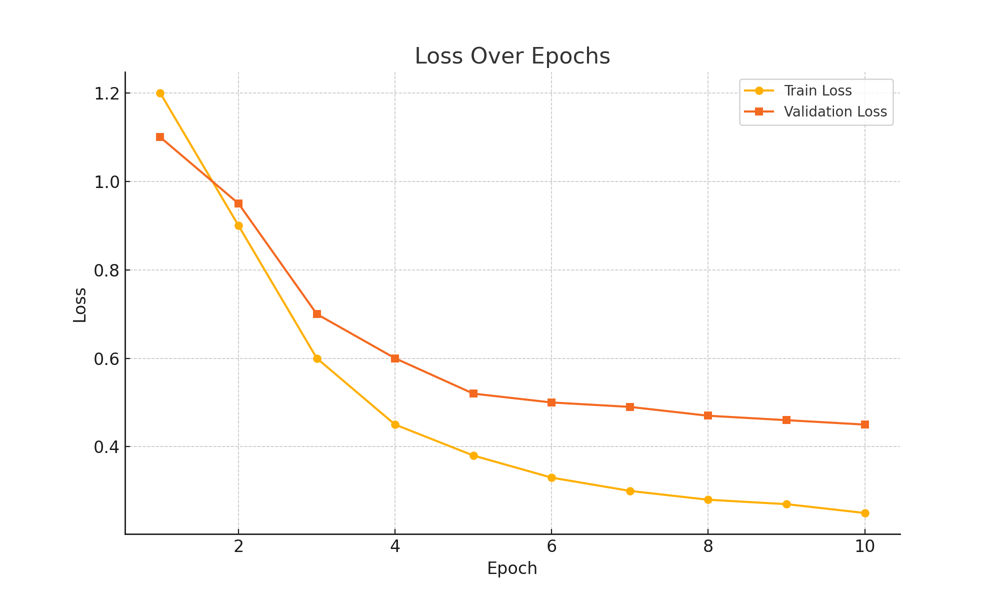
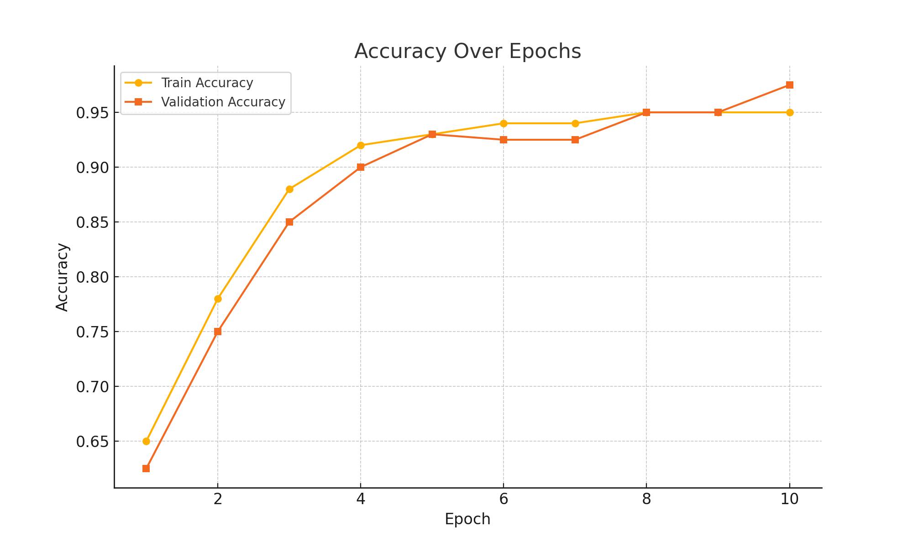

## Table of Contents
- [Dataset](#dataset)
- [Model](#model)
- [Results Summary](#results-summary)
- [Included Files](#included-files)
- [Training Performance](#training-performance)
- [Author](#author)

# Dill vs. Parsley Classification with Transfer Learning

This project uses **Transfer Learning** with a **pre-trained ResNet18 model** to classify images of **dill** and **parsley** leaves. The goal is to evaluate how well a deep learning model can distinguish between visually similar herbs using a small dataset.

## Dataset

- Two classes: `dill`, `parsley`
- Validation set: 20 images (fixed)
- Training sets: 5, 20, 30, 50, and 80 images per class (tested in experiments)

## Model

- Architecture: ResNet18 (pre-trained on ImageNet)
- Fine-tuned for binary classification (2 output neurons)
- Epochs: 25 (increased to 125 in the final experiment)
- Learning Rate Scheduler: `StepLR(step_size=30, gamma=0.1)`

## Results Summary

| Training Images | Best Validation Accuracy |
|------------------|---------------------------|
| 5                | 97.5%                     |
| 20               | 90.0%                     |
| 30               | 92.5%                     |
| 50               | 90.0%                     |
| 80               | 95.0% (and up to 97.5%)   |

- Validation accuracy was already high at epoch 0 (due to transfer learning)
- Fast learning within a few epochs
- Stable performance with little overfitting
- Misclassifications occurred due to background clutter, poor lighting, or leaf similarity

## Included Files

- `transfer_learning_5photo.ipynb` – training with 5 images per class
- `transfer_learning_20photo.ipynb` – training with 20 images
- `transfer_learning_30photo.ipynb` – training with 30 images
- `transfer_learning_50photo.ipynb` – training with 50 images
- `transfer_learning_80photo.ipynb` – training with 80 images
- `report.docx` – Project report in Turkish

  ###  Loss over Epochs

###  Accuracy over Epochs

## Author

**Sümeyye Albayrak**  
AI & Deep Learning Term Project – 2025
